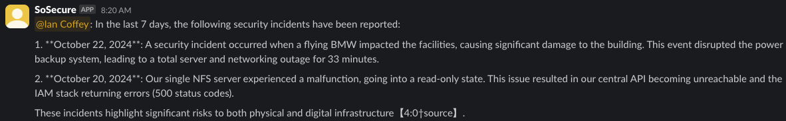

# Sentient

Sentient is a proof of concept demonstrating a simple but powerful approach to processing and researching large-scale security data using LLMs.

Using sentient, security researchers train an Openai Assistant on any abritrary security research data they observe, by identifying and tagging important security messages in Slack.

Uner the hood sentient uses vector stores with file resources to provide a near realtime experience, avoiding fine tuning entirely. Prompt engineering is achieved by assuming an llm persona, providing supporting time series data and example contextualized training data.

Users of any skill level can flag relevant security messages in slack using reactions, and use the tuned LLM to research timeframes using natural language.

